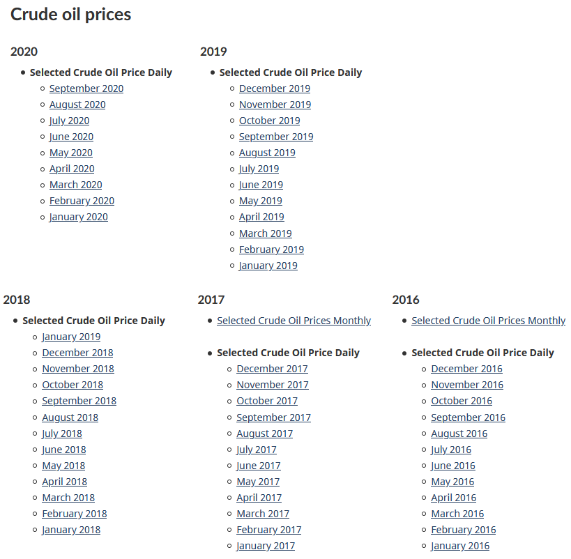
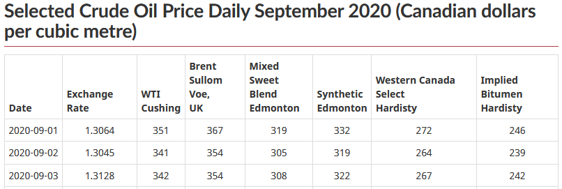

```{r setup, include=FALSE}
knitr::opts_chunk$set(echo = TRUE)
library(gtrendsR)
library(tidyverse)
library(XML)
library(RCurl)
library(rvest)
library(ggplot2)
library(tinytex)
#run tinytex::install_tinytex() to enable pdf print
```

## Introduction

Economics and the mental health of individuals and communities is closely interwoven. Due to COVID-19, more people are spending their days online and socially isolated.
Health-care works, therapists, and those whose work involve treating individuals who are struggling mentally would find information about what individuals are searching
for online and any potential correlations with other events useful as it allows them to be better prepared for increased demand for their services.

This project endeavors to determine a link between what Albertians are searching on any given month and the oil price for that period (and by extension the economy). The oil and gas sector
accounts for 16% of Alberta's GDP so downturns can effect large amounts of people in varying areas.

Online search data was taken from Google Trends using a library which interfaces with their API, and webscraping was used to determine oil prices for the period between 
2016 and 2020.

## Determining Search Data
To begin, a dataframe with negative terms was created. The frequency or "hits" of each term within a week will be returned

```{r}
#Number of data points returned from 5 years.
periodCount <- 261
negativeDF <- data.frame("Date" = 1:periodCount, "Depression" = "", "Guilt" = "", 
                         "Hatred" = "", "Suicide" = "","Death" = "", "Debt" = "",
                         "Angry" = "", "Shitty" = "", "Horrible" = "", 
                         "Alcohol" = "", "Drugs" = "", "Sadness" = "",
                         "Divorce" = "", "Therapy" = "")

i <- 2 #skip Date column
while (i <= length(negativeDF)) {
  results <- gtrends(keyword = colnames(negativeDF)[i], geo = "CA-AB", time = "today+5-y")

  #Add the data column only once
  if(i == 2){
    negativeDF$Date <- results %>% .$interest_over_time %>% .$date
  }
  negativeDF[i] <- results %>% .$interest_over_time %>% .$hits
  i <- i + 1
}

```

We utilize the gtrendsR library to query Google trends with information we require.

* keyword: The work we wish to query. We iterate over the names of the columns from the negativeDF table as these are our search terms

* geo: CA-AB, the region of Alberta Canada

* time: today+5-y indicates we want information from today to 5 years in the past. It should be noted that longer periods of time reduce the frequency of data points you receive, from days to weeks to months.


We store all of this information into the results negativeDF dataframe.
Here is a preview of the extracted data from Google trends with Date and Keyword.

```{r echo=FALSE}
head(negativeDF)
```


Since the data received on search terms is from one day out of every 7 days, we will average it into a month.
This is done using the aggregate function:

```{r}
#Insure that the data column type is recognized as a Date
negativeDF$Date <- as.Date(negativeDF$Date, format = "%Y-%m-%d")
#Create a new Month and Year column based off of the numeric dates in from ex: 2020-01-01
negativeDF$Month <- months(negativeDF$Date)
negativeDF$Year <- format(negativeDF$Date, format = "%y")
#Aggregate the information by finding the average hit rate for each term across each month
#and place that information into emotionsDF
emotionsDF <- aggregate(. ~ Month + Year, negativeDF, mean)
emotionsDF <- subset(emotionsDF, select = -c(Date))
```


Preview of monthly aggregated hit rate by term:

```{r echo=FALSE}
head(emotionsDF)
```


## Determing Oil Prices

After having used an API, we will now scrape the web for information about the price of oil. [StatsCan](https://www.nrcan.gc.ca/our-natural-resources/energy-sources-distribution/clean-fossil-fuels/crude-oil/oil-pricing/18087) provides tables of information grouped by year.




This is this page that we need to scrape. We'll collect all the links which redirect you to a table containing the oil prices for that month. 

```{r}
#Request the html for the webpage
#https://www.nrcan.gc.ca/our-natural-resources/energy-sources-
#distribution/clean-fossil-fuels/crude-oil/oil-pricing/18087"
urlAdd <- 
"https://www.nrcan.gc.ca/our-natural-resources/energy-sources-distribution/clean-fossil-fuels/crude-oil/oil-pricing/18087"
web_content <- read_html(urlAdd)

#Retrieve all the links by searching for "a" node with "href" attribtues
all_links <- web_content %>% html_nodes("a") %>% html_attr('href')
#select only links which contain "selected-crude-oil-price-daily" 
#as those links contain links to the montly data.
all_links <- all_links[which(regexpr("selected-crude-oil-price-daily", all_links)>0)]
```


After having done that, we will enter each link, collect the html information for each page, and utilize a library function to extract information from the table.
The tables in each link and from which we'll extract our data look like this:



```{r message=FALSE}
#Create dataframe containing date and average oil prices.
oilPriceDF <- data.frame("Date"= "", "Average Oil Prices" = "")
index <- 1
#loop through all of the links we determined in the code block above
while(index < length(all_links)){
  #read the HTML page contents
  this_page_content <- read_html(all_links[index])
  #Extract the tables from the page
  tables <- html_nodes(this_page_content, "table")
  #Get the dataframe of the first table, the one pictured above,
  #and place into the oilDt variable.
  oilDt <- html_table(tables, fill = TRUE)[[1]]
  
  #Rename Column Names due to spaces
  colnames(oilDt) <- c("Date", "Exchange_Rate", "WTI_Crushing",
                       "Brent_Sullom_Vow_UK", "Mixed_Sweet_Blend_Edmonton",
                       "Synthetic_Edmonton", "Western_Canada_Select_Hardistry",
                       "Implied_Bitumen_Hardisty")
  
  #Begin to loop through each row in the table
  for(i in 1:nrow(oilDt)){
    #Do not include rows with hyphens or the final column called Average
    if(oilDt$Exchange_Rate[i] != "-" & oilDt$Date[i] != "Average"){
      #Include the current date, and the mean of the costs for each 
      #of the listed crude oils.
      #Try Catch to mismatched columns in older data sets.
      tryCatch({
        oilPriceDF[nrow(oilPriceDF)+1,] <- c(oilDt$Date[i],
                  mean(c(as.numeric(oilDt$WTI_Crushing[i]),
                  as.numeric(oilDt$Brent_Sullom_Vow_UK[i]),
                  as.numeric(oilDt$Mixed_Sweet_Blend_Edmonton[i]), 
                  as.numeric(oilDt$Synthetic_Edmonton[i]),
                  as.numeric(oilDt$Western_Canada_Select_Hardistry[i]),
                  as.numeric(oilDt$Implied_Bitumen_Hardisty[i])),
                  na.rm = TRUE))
      },
      warning=function(err){
        #Do nothing. Warnings are cause by additional columns in older data sets. 
        #They should just be ignored and produced only NA's in table which are 
        #dealt with later.
      })
    }
  }
  index <- index + 1
}

```


We continue on and type set the variables in the dataframe we extracted from each webpage again, while aggregating based off of year and month.


```{r}
#remove inital row which is empty.
oilPriceDF <- oilPriceDF[-c(1),]
#typeset average.oil.prices variables as numerics
oilPriceDF$Average.Oil.Prices <- as.numeric(oilPriceDF$Average.Oil.Prices)
#typeset the dates as dates and indicate proper format
oilPriceDF$Date <- as.Date(oilPriceDF$Date, format = "%Y-%m-%d")
#Create month and year table
oilPriceDF$Month <- months(oilPriceDF$Date)
oilPriceDF$Year <- format(oilPriceDF$Date, format = "%y")
#Aggregate the mean of Average Oil Prices by month and year into 
#the dataframe "aggregatedOilPrices"
aggregatedOilPrice <- aggregate(Average.Oil.Prices ~ Month + Year, oilPriceDF, mean)
```


We now will combine the information about Oil we determined through scraping StatsCan, with the information we determined about word searches from 
Google Trends into one dataframe to make our regression and plotting easier in the coming steps.


```{r}
#create an OilPrice column in the dataframe containing our averaged monthly hits by search 
#term
emotionsDF$OilPrice <- NA
#Search for the same month and year across the two dataframes and 
#combine where a match is determined.
for(i in 1:nrow(aggregatedOilPrice)){
  for(j in 1:nrow(emotionsDF)){
    if(aggregatedOilPrice$Month[i] == emotionsDF$Month[j] & 
        aggregatedOilPrice$Year[i] == emotionsDF$Year[j]){
      emotionsDF$OilPrice[j] <- aggregatedOilPrice$Average.Oil.Prices[i]
    } 
  }
}
#remove Na's which are where no month year matches were found
emotionsDF <- na.omit(emotionsDF)
```


Summary of Table:


```{r echo=FALSE}
head(emotionsDF)
```


## Regression and Data Analysis

### Dot Plot
We know have one dataframe containing monthly hit rates on emotionally negative terms and issues and the average price of crude oil for that period.
In addition to the other columns, we created an Average Negative Emotion column which averages the hit rate per month for our terms.
We'll compare that to the price of crude below:

```{r echo = FALSE}
emotionsDF$AvgNegEmotion <- NA
i<-1
while(i <= nrow(emotionsDF)){
  j <- 2
  val <- 0
  while(j <= ncol(emotionsDF)-1){
    val <- val + as.numeric(emotionsDF[i,j])
    j <- j + 1
  }
  emotionsDF$AvgNegEmotion[i] <- (val / ncol(emotionsDF)-4)
  i <- i + 1
}
```

```{r}
g <- ggplot(emotionsDF, aes(AvgNegEmotion, OilPrice))
g + geom_jitter(width = .5, size=1) + 
      labs(y="Oil Price", 
           x="Averaged Negative Emotion Hits", 
           title="Oil Price vs. Negative Emotion")
```

As you can see from above, both the hit rate for negative emotion and the oil price do go together in general. However,
upon examination we see that in fact it is __when oil price are high we see higher negative emotion searches!__ While this does
re-enforce the claim that oil prices have bearing on people's emotions, a person's first idea might be that when oil is 
low and therefore the economy is worse off you would see more negative searches in Alberta however that appears to not be the case.

### Linear Regression
It's obvious from the above graph that there is some variance from the imaginary trend line. We'll take a closer look at the numbers
that describe this relationship with a linear regression model.

```{r}
regressionModel <- lm(OilPrice ~ AvgNegEmotion, data = emotionsDF)
summary(regressionModel)
```
The H0 hypothesis originally was that there is not correlation and therefore we can not estimate oil prices based
off of the frequency of negative terms searched online by Alberta residents. There is reason enough to reject that hypothesis
in favour of H1 which says there is relationship between negative online searched and oil prices.
Reason:
* P value is less than 2.2e-16. That indicates it's highly unlikely the relationship we see here is due to chance alone

Additionally.

* The average across the search terms chosen to represent negative emotion can explain up to 83.86% of the movement of the price of crude based   off of the adjusted R-squared.

* The F-statistic is 266

Disclaimer: Depending on the day, the data may not match the summary of the regression or plot above. I've provided a globalEnviroment.RData
file in the ZIP to replicate my results. There is a provided script file that matches the code within this RMD file in order to verify my results.

## Conclusion

Alberta is a province highly dependent on the oil and gas industry- when that sector hurts, so do the people and economy of this province.
Additionally, it is no secret that during COVID-19, the up-tick in mental health issues for everyone has risen sharply which
means that examining and understanding where individuals go in the digital space when confronting these issues is more critical and pertinent 
than ever. This mini-project's intent was to demonstrate that there is a connection between O&G and mental well-being within Alberta which it succeeded in 
doing. Additionally, further examination determine that higher oil prices comes along with more negative online searching by Albertians which may have not been the initial intuition an individual may have about this particular idea.